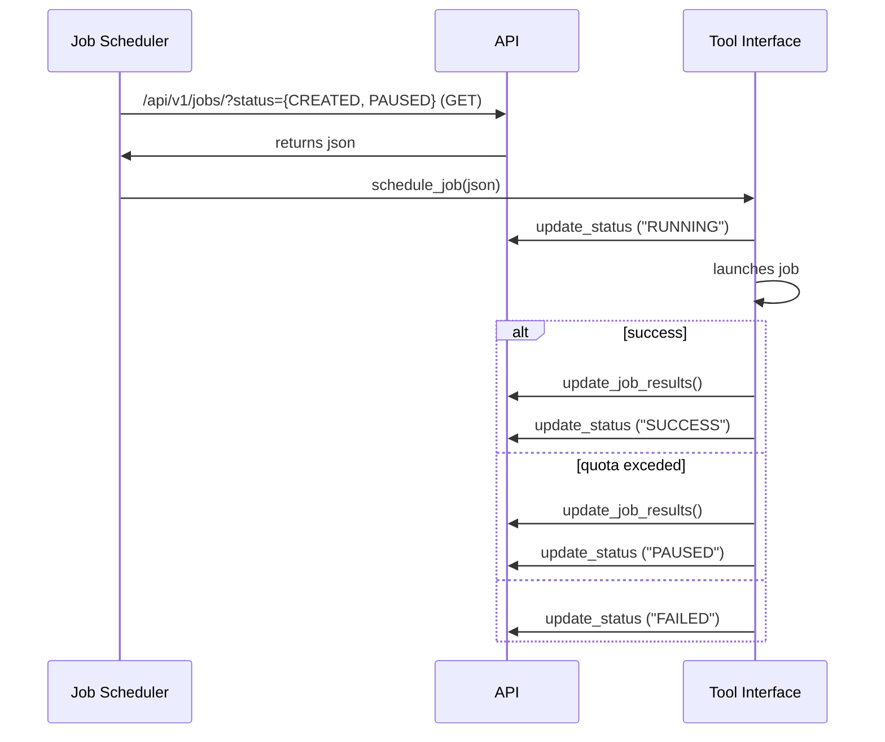

# Sequence diagrams



# Enumerations
## JOB_STATUS
- CREATED
- RUNNING
- PAUSED
- FAILED
- SUCCESS

## SOCIAL_PLATFORM
- YOUTUBE
- REDDIT

# API structure


## Token

### PUT
/api/v1/token/{token_uid}


```json
{
    "type" : "object",
    "properties": {
        "social_platform" : {"enum": ["YOUTUBE", "REDDIT"]},
        "token_quota" : {"type": "number"},
    },
    "required": ["social_platform"],
}
```

Example:
```json
{
    "social_platform" : "YOUTUBE",
    "token_quota" : 23,
}
```


## /api/v1/jobs
### GET
#### Response

```json
[
    {
        "job_uid": 10293,
        "token_uid": 12343,
        "token_detail": {},
        "job_status": "CREATED, RUNNING, PAUSED, FAILED, SUCCESS",
        "social_platform": "YOUTUBE, REDDIT",
        "output_path": "path",
        "job_detail": {},
    }, 
    ...
]
```

##### token_detail YOUTUBE
```json
{
    "api_token":"api_token",
    "token_quota": 0-10000,
    "modified_quota_timestamp": "yyyymmddHHMMSS",
}
```

##### token_detail REDDIT
```json
{
    "client_id": "client_id",
    "secret_token": "token_value",
    "username": "username",
    "password": "password"
}
```

##### job_detail YOUTUBE
For new jobs:
```json
{
    "option": "video, playlist, query, file",
    "actions":"metadata, comments",
    "input":"string",
    "videos": 50,
}
```

For running jobs:

```json
{
    "current_quota" : 1000, 
    "quota_exceeded": true,
    "api_key_valid" = A Boolean value,
    "videos_ids" = A list of videos ids,
    "comments_count" = A dictionary,
    "actions" = A list of actions,
    "all_videos_retrieved" = A Boolean value,
    "all_comments_retrieved" = A Boolean value,
    "error" = A Boolean vaue,
    "error_description" : "string",
}
```

##### job_detail REDDIT
```json
{
    "type": "object",
    "properties" : {
        "sortBy":{"type": "string"},
        "timeframe": {"type": "string"},
        "n": {"type": "number"},
        "subreddit":{"type": "string"},
        "user": {"type": "string"},
        "post": {"type": "string"},
        "keyword": {"type": "string"},
        "getposts": {"type": "string"},
        "getcomments": {"type": "string"},
    }
}
```

### PUT
#### Request Body
```json
{   
    "job_uid": 1,
    "social_platform": "SOCIAL_PLATFORM",
    "job_status": "JOB_STATUS",
    "job_detail": {},
    "job_message": "string"
}
```
Where job_detail:

```json
{
    "job_name":"freedomconvoyjob11",
    "job_submit":{
        "option_type":"VIDEO",
        "option_value":"https://youtube.com/id/109-4sjfl",
        "actions":["METADATA","COMMENT"],
        "video_count":"45"
        },
    "job_resume":{
        "current_quota":"0",
        "quota_exceeded":"false",
        "api_key_valid":"true",
        "all_videos_retrieved":"false","all_comments_retrieved":"false",
        "error":"",
        "error_description":""
    }
}
````

#### Response
```json
{
    "result": 
}
```


# Output file location

/home/atlin/output/\<platform>/\<date_time_created>_\<uuid>

date_time_created is the time from the database .
Format: yyyymmddHHMMSS
